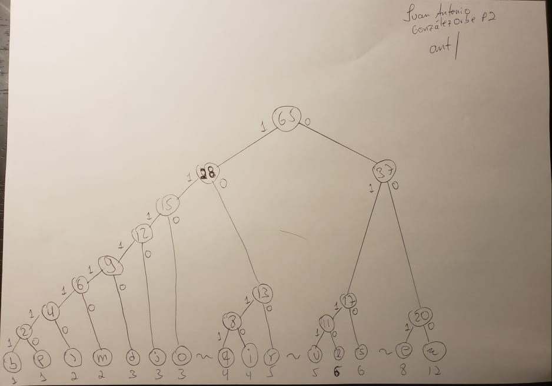

Genere la tabla de código Huffman para cada carácter y muestre el porcentaje
de compresión obtenido.

**Texto a comprimir**:

`j'aime aller sur le bord de l'eau les jeudis ou les jours impairs`

## Pasos

1. Obtener la tabla de frecuencias (repeticiones de cada carácter)
2. Realizar el árbol binario
3. Generar la tabla con el código Huffman
4. Obtener el porcentaje de compresión del texto considerando que cada símbolo
   en código ASCII es representado con 8 bits.

## Tabla de contenidos

- [Tabla de frecuencia](#Tabla-de-frecuencia)
- [Árbol binario](#Árbol-binario)
- [Tabla Código Huffman](#Tabla-Codigo-Huffman)
- [Recursos](#Recursos)

\clearpage

### Tabla de frecuencia

| char | frec |
| ---- | ---- |
|      | 12   |
| `e`  | 8    |
| `s`  | 6    |
| `l`  | 6    |
| `u`  | 5    |
| `r`  | 5    |
| `i`  | 4    |
| `q`  | 4    |
| `o`  | 3    |
| `j`  | 3    |
| `d`  | 3    |
| `m`  | 2    |
| `'`  | 2    |
| `p`  | 1    |
| `b`  | 1    |

NOTA: _carácter vacío simboliza un espacio_

### Árbol binario

<!-- markdownlint-disable MD045 -->

### Tabla Código Huffman

| char          | cod      | frec | bits        |
| ------------- | -------- | ---- | ----------- |
|               | 000      | 12   | $12*3$ = 36 |
| `e`           | 001      | 8    | $8*3$ = 24  |
| `s`           | 010      | 6    | $6*3$ = 18  |
| `l`           | 0110     | 6    | $6*4$ = 24  |
| `u`           | 0111     | 5    | $5*4$ = 20  |
| `r`           | 100      | 5    | $5*3$ = 15  |
| `i`           | 1010     | 4    | $4*4$ = 16  |
| `q`           | 1011     | 4    | $4*4$ = 16  |
| `o`           | 110      | 3    | $3*3$ = 9   |
| `j`           | 1110     | 3    | $3*4$ = 12  |
| `d`           | 11110    | 3    | $3*5$ = 15  |
| `m`           | 111110   | 2    | $2*6$ = 12  |
| `'`           | 1111110  | 2    | $2*7$ = 14  |
| `p`           | 11111110 | 1    | $1*8$ = 8   |
| `b`           | 11111111 | 1    | $1*8$ = 8   |
| ----          | -------- | ---- | ---------   |
| total de bits |          |      | 247         |

NOTA: _carácter vacío simboliza un espacio_

**Total de bits sin compresión** = $520$

**Total de bits post-compresión** = $247$

---

**Porcentaje de compresión**:

`valor inicial` $= vi$

`valor final` $= vf$

$\frac{vi - vf}{|vi|}*100$

$\frac{520 - 247}{|520|}*100 = 52.5$%

\clearpage

## Recursos

[Huffman Coding - Greedy Algorithm](https://youtu.be/dM6us854Jk0)

[Huffman Coding - Algorithm Visualizations](https://people.ok.ubc.ca/ylucet/DS/Huffman.html)
