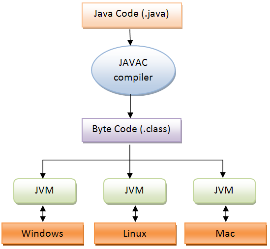
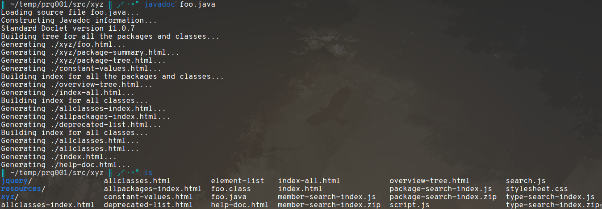
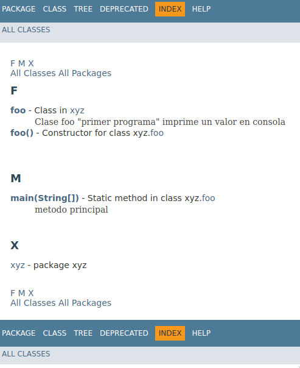

# lectura 1

## características

- sencillo
- orientado a objetos
- independiente (portable) (multi-plataforma)
- multi-tarea
- WORE (Write Once Run Everywhere)

## partes fundamentales de Java

- el lenguaje en sí
- la máquina virtual (VM)
- conjunto de APIs

## distribuciones de Java

- Java ME (dispositivos móviles)
- Java SE (aplicaciones de escritorio)
- Java EE (redes)

## estructura de un programa en Java

- mínimo 1 clase (contiene el método `main()`)
- ejemplo de un programa simple:

  - ```java
    public class foo {
        public static void main(String[] args) {
            /* imprime 'hey' en consola */
            System.out.println("hey");
        }
    }
    ```

    - \* el nombre del archivo es `foo.java`

- conjunto de sentencias (en el ejemplo solo hay 1 `println()`)

## compilación y ejecución de un programa

`Java Source Code` -> `Compilador` -> `Java Bytecode` -> `Ejecución`



## comentarios con javadoc

se pueden agregar comentarios de implementación y documentación usando
la herramienta **javadoc**

- agregando la documentación correspondiente al programa anterior:

  - ```java
      /**
     * Clase foo "primer programa"
     * imprime un valor en consola
     *
     * @author anntnzrb
     */
    public class foo {
        /**
         * metodo principal
         * @param args parametros del metodo
         */
        public static void main(String[] args) {
            /* imprime 'hey' en consola */
            System.out.println("hey");
        }
    }
    ```

- se ejecuta el comando `javadoc foo.java`:

  - 

- se generan distintos archivos, entre esos, algunos de tipo `hmtl`, si se abre
  `index.html` se puede ver de forma **local** una vista general del programa:

  - 

## tarea

```txt
TAREA:

Escriba un programa en java que se llame ValorMayor.java. Este programa debe
recibir por consola dos números y debe verificar cuál de los dos números es
mayor, finalmente debe mostrar en pantalla un mensaje, por ejemplo:

Los números ingresados son a y b y el mayor es b
```
