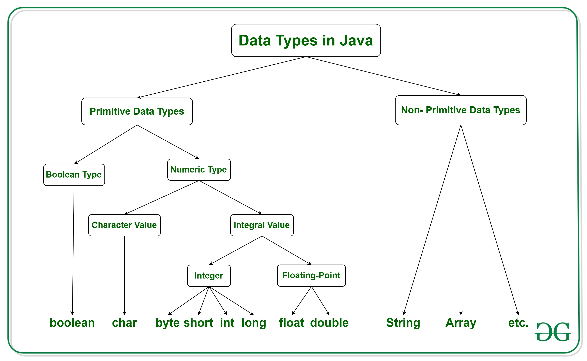

<!-- markdownlint-disable MD013 MD024 MD026 -->

# notas de Java (poo)

## :large_orange_diamond: tipos de datos

### :small_blue_diamond: datos primitivos

**enteros**:

| tipo de dato | tamaño  | rango                                                          |
| ------------ | ------- | -------------------------------------------------------------- |
| _byte_       | 1 byte  | -128 :left_right_arrow: +127                                   |
| _short_      | 2 bytes | -32768 :left_right_arrow: +32767                               |
| _int_        | 4 bytes | -2147483648 :left_right_arrow: +2147483647                     |
| _long_       | 8 bytes | -9223372036854775808L :left_right_arrow: +9223372036854775807L |

> :exclamation: por defecto, Java considera a todos los números que no tengan
> decimales como `int`, para utilizar específicamente `long` es necesario agregar
> una `l` o `L` al final del dígito

_e.g_ :

- `long numero = 2147483648L;`

---

**decimales**:

| tipo de dato | tamaño  | dígitos significativos                    |
| ------------ | ------- | ----------------------------------------- |
| _float_      | 4 byte  | ~-3.40e-38f :left_right_arrow: ~+3.40e38f |
| _double_     | 8 bytes | ~-1.79e-308 :left_right_arrow: ~+1.79e308 |

> :exclamation: por defecto, Java considera a todos los dígitos decimales
> como `double`, para utilizar específicamente `float` es necesario agregar una
> `f` o `F` al final del dígito

_e.g_ :

- `float decimal = 9.8F;`

**caracteres**:

| tipo de dato | tamaño  | rango                                                                           |
| ------------ | ------- | ------------------------------------------------------------------------------- |
| _char_       | 2 bytes | (UNICODE) '\u0000' :left_right_arrow: '\uffff' **ó** 0 :left_right_arrow: 65535 |

_e.g_ :

- ```java
  char c1 = 'N';  /* N */
  char c2 = 'n';  /* n */
  /* (UNICODE) */
  char c1u_a = 78;       /* N */
  char c2u_a = 110;      /* n */
  char c1u_b = '\u004E'; /* N */
  char c2u_b = '\u006E'; /* n */
  ```

**booleano**:

| tipo de dato | tamaño | características               |
| ------------ | ------ | ----------------------------- |
| _boolean_    | 1 bit  | true :left_right_arrow: false |



## :large_orange_diamond: arreglos

son colecciones de elementos

### :small_blue_diamond: características

- elementos del mismo tipo
- tamaño fijo
- multi-dimensionals

### sintaxis

`tipo_dato[] var = new tipo_dato[n]`

- `tipo_dato` -> `short`,`int`,`double`, ...
- `var` -> nombre del arreglo
- `n` -> tamaño del arreglo

```java
/* 1 dimension */

/* declaracion y creacion del arreglo */
int[] arr1 = new int[10]; /* arreglo de tamaño 10 */

/* declaracion */
int[] arr2;
/* creacion */
arr2 = new int[5]; /* arreglo de tamaño 5 */

/* asignacion de valores al crear arreglo */
String[] arr3 = {"uno", "annt", "hey"};
```

## :large_orange_diamond: classes

### :small_blue_diamond: Scanner

la class `Scanner` permite ingresar información através del teclado, ésta
pertenece al paquete `java.util`

- importar class `Scanner`:

  - `import java.util.Scanner;`

- crear una nueva instancia de la class `Scanner`:

  - `Scanner input = new Scanner(System.in);`
  - `input` puede ser cualaquier nombre (similar a crear una variable)

#### :small_red_triangle_down: métodos

es necesario utilizar diferentes métodos para guardar diferentes tipos de datos

- datos numéricos:

  - ```java
    input.nextByte();
    input.nextShort();
    input.nextInt();
    input.nextLong();
    input.nextFloat();
    input.nextDouble();
    ```

- cadenas de caracteres:

  - ```java
    input.next();     /* acepta caracteres hasta encontrar un espacio */
    input.nextLine(); /* acepta múltiples palabras */
    ```

- booleanos:

  - ```java
    input.nextBoolean();
    ```

## :large_orange_diamond: programación orientada a objetos (poo)

### :small_blue_diamond: características

existen **4** conceptos fundamentos en la programación orientada a objetos:

- encapsulamiento
- herencia
- polimorfismo
- abstraccion

los objetos tienen 2 propiedades:

- atributos
- métodos

asumamos a un :racehorse: **caballo** como un objeto:

- atributos
  - filo (mamifero/anfiobio/etc)
  - peso
  - color
- métodos
  - correr
  - comer
  - dormir

una **class** describe (en macro) lo que es el objeto... se puede generalizar
al :racehorse: caballo como un animal, por lo tanto, la **class** puede
llamarse animal

```java
public class Animal {

    /* atributos */
    String filo;
    String nombre;
    float peso;
    String color;

    public static void
    main(String[] args)
    {
        /*
         * en el primer ejemplo se crea a un caballo, y en el segundo,
         * una rana;
         *
         * notar que ambos (animales) comparten atributos
         *
         */

        /* creación del caballo */
        Animal a1 = new Animal();
        a1.filo = "mamifero";
        a1.nombre = "caballo";
        a1.peso = 3f;
        a1.color = "cafe";

        /* creación de la rana */
        Animal a2 = new Animal();
        a2.filo = "anfiobio";
        a2.nombre = "rana";
        a2.peso = 524.76f;
        a2.color = "verde";

        System.out.printf(
            "animal: %s ; filo: %s ; peso: %.2fkg ; color: %s %n",
            a1.nombre, a1.filo, a1.peso, a1.color);

        System.out.printf(
            "animal: %s ; filo: %s ; peso: %.2fkg ; color: %s %n",
            a2.nombre, a2.filo, a2.peso, a2.color);

    }
}
```

:hash:

```markdown
animal: caballo ; filo: mamifero ; peso: 3.00kg ; color: cafe
animal: rana ; filo: anfiobio ; peso: 524.76kg ; color: verde
```

:information_source: ejemplo de una calculadora se pueden encontrar
[aqui](./prg008/src/)

### :small_blue_diamond: modificadores de acceso

[:information_source:](https://javadesdecero.es/poo/modificadores-de-acceso/)
sirven para restringir el acceso a los miembros de una clase

- ayudan a evitar el mal uso de un objeto
- pueden evitar que se asignen valores incorrectos a esos datos

#### classes

| modificador de acceso | paquete            | class              | sub-class          | todo               |
| --------------------- | ------------------ | ------------------ | ------------------ | ------------------ |
| public                | :heavy_check_mark: | :heavy_check_mark: | :heavy_check_mark: | :heavy_check_mark: |
| default               | :heavy_check_mark: | :heavy_check_mark: | :x:                | :x:                |

#### atributos y metodos

| modificador de acceso | paquete            | class              | sub-class          | todo |
| --------------------- | ------------------ | ------------------ | ------------------ | ---- |
| public                | :heavy_check_mark: | :heavy_check_mark: | :heavy_check_mark: | sí   |
| default               | :heavy_check_mark: | :heavy_check_mark: | :x:                | :x:  |
| private               | :x:                | :heavy_check_mark: | :x:                | :x:  |
| protected             | :heavy_check_mark: | :heavy_check_mark: | :heavy_check_mark: | :x:  |

- es una buena practica manejar variables **privadas**, ya que estas pueden
  ser manipuladas con **getters** y **setters**

### :small_blue_diamond: getters & setters

son usados para proteger efectivamente los datos, específicamente al momento
de crear nuevas clases

los **setters** toman un parametro y se lo asignan al atributo, mientras que
los **getters** son los que retornan el valor del atributo

sintaxis para crear un **setter** y **getter**:

- getter

  - ```java
    public getNombre() {}
    ```

- setter

  - ```java
    public void setNombre(tipo_dato arg) {}
    ```

### :small_blue_diamond: constructores

son metodos especiales que se invocan cuando se crea un objeto, este puede ser
utilizado para inicializar valores a los atributos

### :small_blue_diamond: características

- mismo nombre que la class
- no tienen un return type
- se pueden tener varios constructores
  - estos se diferencian por la cantidad de parametros que reciben
  - esto se llama "sobrecarga de metodos"

```java
public class Animal {

    private String color;

    /*
     * en este caso, cuando se instancie el objeto sin algun argumento, por
     * default se asignara el color "cafe" al atributo color
     */

    public Animal()
    {
        this.setColor("cafe");
    }
    /*
     * por otro lado, cuando se instancie el objeto especificando algun
     * argumento, por ejemplo "verde" se asignara dicho color al atributo color
     */
    public Animal(String c)
    {
        this.setColor(c);
    }

    /* setter */
    public void
    setColor(String c)
    {
        this.color = c;
    }

    /* getter */
    public String
    getColor(String c)
    {
        return this.color;
    }
}
```

:information_source: ejemplo de sobrecarga de metodos se encuentra
[aqui](./prg010/src/)

### :small_blue_diamond: clases abstractas

las clases abstractas pueden tener:

- métodos regulares (concretos y definidos por `{}`) (con cuerpo)
- métodos abstractos (sin cuerpo)
- mezcla de los dos anteriores

#### ejemplo

si una clase tiene un método abstracto, entonces la clase automáticamente debe
ser declara como abstracta de igual manera

```java
abstract class A {
    /* metodo abstracto */
    abstract public void m();

    /* metodo regular (concreto) */
    public void m2() {
        foo();
    }
}
```

_(sea el ejemplo anterior)_
debido a que los métodos abstractos no están implementados, es necesario
implementarlos en clases concretas, de hecho, si no se implementan, habrá
un error

```java
class B extends A {
    /* este metodo es heredado de la clase abstracta A */
    public void m() {
        bar();
    }
}
```

se puede crear una clase abstracta sin la necesidad de implementar métodos
abstractos (por ende, que contenga métodos concretos)

```java
abstract class A {
    private int i = 10;

    public void z() {
        foo();
    }
}
```

una clase abstracta puede extender a otra clase abstracta sin proveer alguna
implementación de sus métodos abstractos

```java
abstract class A {
    abstract public void m();
}

abstract class B extends A {
    /* algo */
}
```

una clase abstracta no puede ser instanciada, porque fue creada con el
propósito de ser extendida por una clase concreta

> :exclamation: no se debe declarar a un método abstracto como `private` porque
> esto haría que el método sea inaccesible por la clase concreta que extiende a
> la clase abstracta que tiene como propósito implementar dicho método

### :small_blue_diamond: interfaces

una interfaz es una clase abstracta, los métodos declarados son implícitamente
abstractos, por lo cual, no se debe realizar la implementación de métodos

las interfaces son declaras implícitamente como `public` y `abstract`, por lo
cual es redundante re-escribir dichas _keywords_

al igual que las clases abstractas, las interfaces no se pueden instanciar

#### ejemplo

```java
interface Matematicas {
    /* metodos publicos y abstractos por default */
    void sumar(int a, int b);
    void restar(int a, int b);
}
```

_(sea a partir del ejemplo anterior)_
una clase puede implementar a una interfaz, se debe realizar la implementación
de los métodos

```java
class A implements Matematicas {
    public void sumar(int a, int b) {
        System.out.println(a + b);
    }

    public void restar(int a, int b) {
        System.out.println(a - b);
    }
}
```

las variables definidas en las interfaces son implícitamente
`public final static`, por ende, éstas son consideradas constantes

```java
interface A {
    /* variable 'a' cuyo valor no se puede cambiar */
    int a = 10;
}
```

una interfaz puede implement's otras interfaces sin la necesidad de realizar
la implementación de sus métodos

```java
interface A {
    void foo();
}

interface B {
    void bar();
}

interface C extends A, B {
/* */
}
```

una clase puede implementar múltiples interfaces, pero se debe realizar la
implementación de todos los métodos de las distintas interfaces

```java
interface A {
    void foo();
}

interface B {
    void bar();
}

interface C {
    void baz();
}

class D implements A, B, C {
    public void foo() {
        System.out.println("A");
    }

    public void bar() {
        System.out.println("B");
    }

    public void baz() {
        System.out.println("C");
    }
}
```

una clase abstracta puede implementar una interfaz sin la necesidad de
implementar sus métodos. esto es posible ya que las clases abstractas son
funciones esqueleto (sin cuerpo) que están en la posibilidad de tener de igual
manera métodos sin algún cuerpo

```java
interface Matematicas {
    void sumar(int a, int b);
    void restar(int a, int b);
}

abstract class A implements Math {
/* */
}
```

## :large_orange_diamond: random

:information_source: sección donde se puede encontrar contenido misceláneo

### :small_blue_diamond: programa de ejemplo

en el siguiente bloque de código se muestra un programa básico en Java

```java
public class prog001 {
    public static void
    main(String[] args)
    {
        System.out.println("hey");
    }
}
```

:hash: `hey`

> :exclamation: el nombre del archivo (`prog001.java`) debe ser igual al nombre
> de la class (en el caso de ser una **class pública**)
> [:information_source:](https://stackoverflow.com/a/2324915)

### :small_blue_diamond: qué es System.out?

- `System` es una _clase_

- `out` es un _objeto_

- `print()` ; `println()` ; `...` son _métodos_ del _objeto_ `out`

`System.out.println()`

### :small_blue_diamond: nextXXX en Scanner

Mixing any `nextXXX` method with `nextLine` from the `Scanner` class for user
input, will not ask you for input again but instead result in an empty line
read by nextLine.

To prevent this, when reading user input, always only use `nextLine`. If you
need an int, do:

`int value = Integer.parseInt(scanner.nextLine());`

instead of using `nextInt`.

Assume the following:

```java
Scanner scanner = new Scanner(System.in);

System.out.println("Enter your age:");
int age = scanner.nextInt();
System.out.println("Enter your name:");
String name = scanner.nextLine();

System.out.println("Hello " + name + ", you are " + age + " years old");
```

When executing this code, you will be asked to enter an age, suppose you
enter `20`.
However, the code will not ask you to actually input a name and the output
will be:

`Hello , you are 20 years old.`

The reason why is that when you hit the enter button, your actual input is
`20\n` and not just `20`. A call to nextInt will now consume the `20` and
leave the newline symbol `\n` in the internal input buffer of `System.in`
The call to nextLine will now not lead to a new input, since there is still
unread input left in `System.in` So it will read the `\n`, leading to an
empty input.

So every user input is not only a number, but a full line. As such, it makes
much more sense to also use `nextLine()`, even if reading just an age. The
corrected code which works as intended is:

```java
Scanner scanner = new Scanner(System.in);

System.out.println("Enter your age:");
// Now nextLine, not nextInt anymore
int age = Integer.parseInt(scanner.nextLine());
System.out.println("Enter your name:");
String name = scanner.nextLine();

System.out.println("Hello " + name + ", you are " + age + " years old");
```

The nextXXX methods, such as `nextInt` can be useful when reading multi-input
from a single line. For example when you enter `20 John` in a single line.

## :large_orange_diamond: estilo de codificación

:link: [Java Programming Styles](https://youtu.be/OXYT01qrDrc)
:pencil:[Neso Academy](https://www.youtube.com/user/nesoacademy/)

:link: [c-code-style](https://github.com/MaJerle/c-code-style)
:pencil:[MaJerle](https://github.com/MaJerle)
